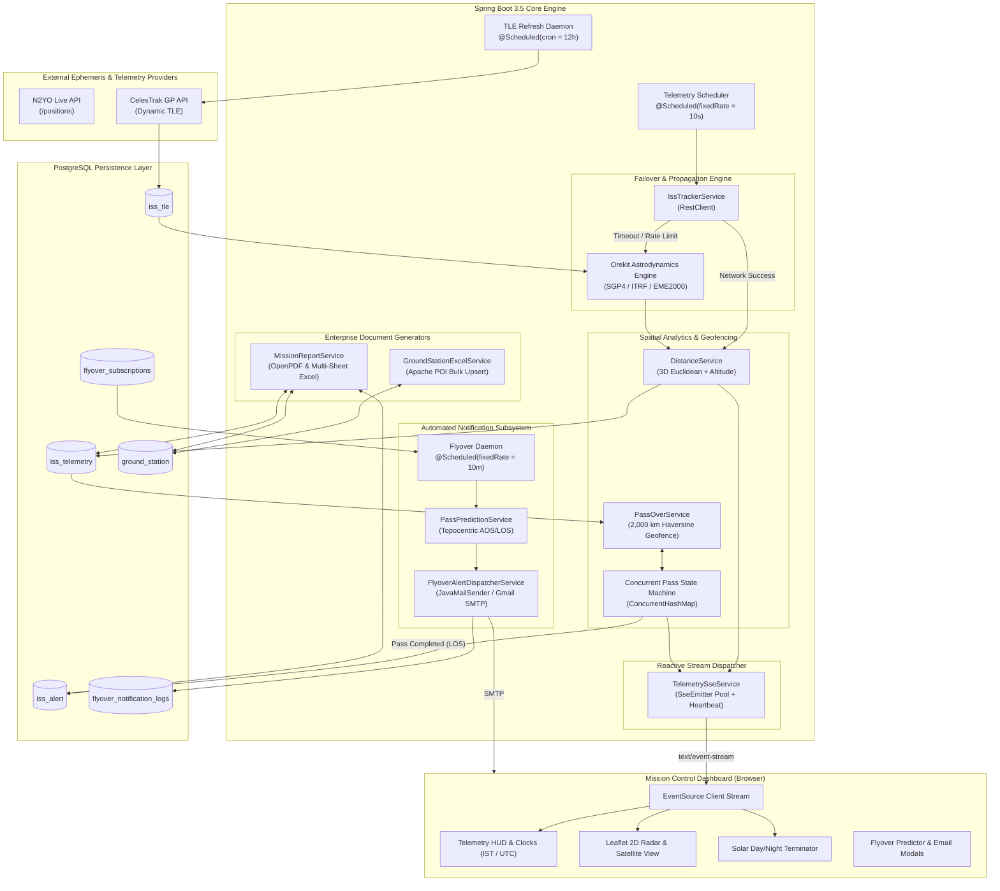

<p align="center">
  
</p>

<h1 align="center">ORBITTRACK: ISS Telemetry & Ground Geofencing Operations Center</h1>

<p align="center">
  <b>A High-Throughput Satellite Telemetry Streaming, Astrodynamics Orbital Mechanics Propagator & Spatial Geofencing Platform.</b>
</p>

<p align="center">
  <a href="#key-engineering-highlights"></a>
  <a href="#key-engineering-highlights"></a>
  <a href="#key-engineering-highlights"></a>
  <a href="#key-engineering-highlights"></a>
  <a href="#key-engineering-highlights"></a>
  <a href="#key-engineering-highlights"></a>
  <a href="#license"></a>
</p>

---

## 📌 Table of Contents

- [Executive Summary](#-executive-summary)
- [System Architecture & Data Flow](#-system-architecture--data-flow)
- [Key Engineering Highlights (Why It's Resume-Worthy)](#-key-engineering-highlights-why-its-resume-worthy)
- [Core Features](#-core-features)
  - [1. Real-Time Telemetry Pipeline & Self-Healing SGP4 Propagator](#1-real-time-telemetry-pipeline--self-healing-sgp4-propagator)
  - [2. Spatial Geofencing & Contact State Machine](#2-spatial-geofencing--contact-state-machine)
  - [3. Reactive Real-Time Streaming via Server-Sent Events (SSE)](#3-reactive-real-time-streaming-via-server-sent-events-sse)
  - [4. Astronomical Flyover Predictor Engine (AOS / LOS)](#4-astronomical-flyover-predictor-engine-aos--los)
  - [5. Automated Flyover Email Notification Dispatcher](#5-automated-flyover-email-notification-dispatcher)
  - [6. Enterprise Document & Data Processing (Excel & PDF)](#6-enterprise-document--data-processing-excel--pdf)
  - [7. Mission Control Glassmorphism Dashboard](#7-mission-control-glassmorphism-dashboard)
- [Mathematical & Physics Formulations](#-mathematical--physics-formulations)
- [REST API Reference](#-rest-api-reference)
- [Database Schema & Entity Relationship](#-database-schema--entity-relationship)
- [Technology Stack](#-technology-stack)
- [Configuration Reference (`application.properties`)](#-configuration-reference-applicationproperties)
- [Getting Started & Local Setup](#-getting-started--local-setup)
- [Resume-Ready Bullet Points & Interview Guide](#-resume-ready-bullet-points--interview-guide)
- [Author & License](#-author--license)

---

## 🚀 Executive Summary

**ORBITTRACK** is a production-grade, aerospace-focused mission control application built with **Java 21**, **Spring Boot 3.5**, and **PostgreSQL**. The platform performs continuous real-time tracking, spatial analytics, and orbital mechanics computation for the **International Space Station (ISS - NORAD Catalog ID: 25544)** traveling at ~27,600 km/h (Mach 22.5).

Rather than acting merely as an API proxy, OrbitTrack embeds an **astrodynamics physics engine (Orekit 13.0.3 / SGP4)** to achieve **zero-downtime, self-healing telemetry propagation** during external API outages. The platform monitors a global network of **46+ international tracking stations** (ISRO, NASA DSN, ESA ESTRACK, JAXA, and KSAT) within a 2,000 km radio horizon, streams real-time state changes via **Server-Sent Events (SSE)**, calculates upcoming visible astronomical flyovers, sends automated transactional email alerts via **Spring Mail / SMTP**, and produces automated audit documentation in **PDF** and multi-sheet **Excel**.

---

## 🏛️ System Architecture & Data Flow



---

## 🌟 Key Engineering Highlights (Why It's Resume-Worthy)

| Capability | Technical Implementation | Why Interviewers Love It |
| :--- | :--- | :--- |
| **Astrodynamics Physics Engine** | **Orekit 13.0.3** + **Hipparchus** integrated with **SGP4 analytical orbital propagation**, transforming ITRF (Earth-fixed) coordinates to EME2000 (Inertial) reference frames. | Demonstrates applied orbital mechanics and complex numerical algorithms beyond CRUD operations. |
| **Self-Healing Fallback Pipeline** | Automatic circuit-level fallback from **N2YO REST API** to local SGP4 dynamic propagation during network partition or rate limits. | Proves high-availability resilience and enterprise failover engineering. |
| **3D Spatial Mathematics** | Dual calculation pipeline: **3D Euclidean Cartesian coordinate conversion** accounting for geodetic orbital radius ($R_E + Altitude$) + **Spherical Haversine geofencing**. | Demonstrates deep mathematical aptitude and spatial data structures. |
| **Reactive Real-Time Streaming** | Spring Web MVC **Server-Sent Events (`SseEmitter`)** pool with heartbeat keep-alives and non-blocking multi-client broadcast. | Shows hands-on experience with real-time reactive architectures and thread safety. |
| **Thread-Safe State Machine** | Dynamic in-memory tracking of pass lifecycle (AOS entry, active transit, LOS exit) across dozens of stations simultaneously via `ConcurrentHashMap`. | Demonstrates concurrent programming, race-condition mitigation, and in-memory caching. |
| **Automated Job Dispatcher** | Asynchronous background scheduling (`@Scheduled`), idempotency guards, and rich HTML email dispatching via **Spring Mail / JavaMailSender**. | Proves experience with background daemon execution, batch processing, and transactional messaging. |
| **Enterprise Document Processing** | Multi-sheet **Apache POI** workbook generation and automated **OpenPDF** mission audit report generation. | Essential for enterprise applications requiring compliance, audits, and bulk data import/export. |

---

## 🛠️ Core Features

### 1. Real-Time Telemetry Pipeline & Self-Healing SGP4 Propagator
- Executes an automated **10-second polling pipeline** (`@Scheduled(fixedRate = 10000)`).
- Captures WGS-84 Latitude, Longitude, Altitude (km), Orbital Velocity (km/s and km/h), Solar Exposure state (`daylight` vs `eclipsed`), and UTC/IST timestamps.
- **Automated Fallback Architecture**: If external satellite APIs fail, timeout, or hit rate limits, the system dynamically switches to **Orekit's SGP4 Propagator**, calculating exact satellite position and velocity using the latest ingested Two-Line Element (TLE) ephemeris from CelesTrak.
- Automated 12-hour TLE refresh daemon keeps ephemeris drift below 1 km.

### 2. Spatial Geofencing & Contact State Machine
- Defines a spherical **2,000 km radio horizon geofence** around 46+ global tracking stations.
- Tracks station airspace transit states in a thread-safe `ConcurrentHashMap`:
  - **AOS (Acquisition of Signal)**: Fires when distance $\le 2,000\text{ km}$; timestamps entry point and coordinates.
  - **In-Transit**: Station turns bright red on the interactive radar, and its geofence bubble pulses to indicate active communication.
  - **LOS (Loss of Signal)**: Fires when distance $> 2,000\text{ km}$; calculates total transit duration (seconds), exit coordinates, and persists an immutable audit record in PostgreSQL (`IssAlert`).

### 3. Reactive Real-Time Streaming via Server-Sent Events (SSE)
- High-efficiency, unidirectional streaming endpoint at `GET /api/stream`.
- Eliminates frontend polling overhead by pushing live telemetry updates and ground station contact alerts immediately to all connected browsers.
- Includes a **15-second heartbeat ping** daemon (`@Scheduled(fixedRate = 15000)`) preventing HTTP proxy timeouts and automatically removing dead client emitters from memory (`CopyOnWriteArrayList`).

### 4. Astronomical Flyover Predictor Engine (AOS / LOS)
- Predicts upcoming visible sightings and radio passes over any city or ground station worldwide over a **1 to 5 day forecast window**.
- Computes **Topocentric Elevation Angles** from the observer's local horizontal frame using Orekit's WGS-84 Earth model.
- Automatically grades pass quality:
  - `HIGH OVERHEAD PASS ★` ($\ge 40^\circ$ maximum elevation — optimal for naked-eye observation).
  - `MEDIUM PASS` ($20^\circ \text{ to } 40^\circ$).
  - `LOW GRAZING PASS` ($1^\circ \text{ to } 20^\circ$).
- Classifies lighting conditions based on solar angles:
  - 🌟 **VISIBLE SIGHTING** (Twilight / dawn pass where the station is illuminated by sunlight against a dark sky).
  - ☀️ **DAYLIGHT PASS**
  - 📡 **NIGHT RADIO PASS** (Spacecraft is eclipsed in Earth's shadow).

### 5. Automated Flyover Email Notification Dispatcher
- Users subscribe by entering their email, target city coordinates, and minimum elevation threshold.
- A **10-minute background scheduler** evaluates whether the ISS will pass over any subscriber's location within the next **2 hours**.
- Dispatches a responsive, NASA-themed HTML alert containing:
  - Exact Acquisition of Signal (AOS) & Loss of Signal (LOS) formatted in **Indian Standard Time (IST)**.
  - Pass duration, max elevation angle, and orbital velocity.
  - Practical naked-eye stargazing viewing tips (azimuth, appearance, brightness comparison to Venus/Jupiter).
- Prevents duplicate alerts via an **idempotent pass tracker** (`lastNotifiedAosEpoch`).
- Persists all delivery records in `flyover_notification_logs` with delivery status (`DELIVERED_SMTP` or `SIMULATED_LOG`).
- Includes an **Instant Test Dispatch** feature for live interview demos.

### 6. Enterprise Document & Data Processing (Excel & PDF)
- **Bulk Ground Station Ingestion (Apache POI)**:
  - Drag-and-drop upload of `.xlsx` / `.xls` files.
  - Validates coordinate bounds ($\text{Lat} \in [-90, 90]$, $\text{Lon} \in [-180, 180]$) and performs database upserts.
  - Includes a downloadable pre-formatted template pre-populated with 46 world-class tracking stations.
- **Mission Audit PDF Report (OpenPDF)**:
  - Generates downloadable, multi-page mission audit reports complete with corporate aerospace palettes, executive summaries, historical geofence pass logs, and station contact distribution.
- **Mission Audit Excel Workbook (.xlsx)**:
  - Produces a multi-sheet spreadsheet containing three distinct audit worksheets:
    1. *Mission Overview* (cumulative distance, telemetry ping totals, contact time).
    2. *Geofence Pass History* (full AOS/LOS timestamps, durations, entry/exit coordinates).
    3. *Station Analytics* (aggregated contact frequency distribution).

### 7. Mission Control Glassmorphism Dashboard
- **Dual Live Clocks**: Real-time synchronized digital clocks displaying Indian Standard Time (IST) and Coordinated Universal Time (UTC).
- **Telemetry HUD Strip**: 6 metric cards displaying WGS-84 Coordinates, Orbital Speed (km/s, km/h, Mach 22.5), Altitude (km), Closest Ground Station Proximity, Solar Illumination (`DAYLIGHT` / `ECLIPSED`), and Ingestion Pipeline health.
- **Interactive Leaflet Radar**:
  - Dual-basemap toggle: **Dark Matter Radar** vs. **ESRI High-Resolution Satellite Imagery**.
  - Real-time **Solar Day/Night Terminator shadow** rendering day/night boundaries across the globe.
  - **Dynamic Sine Orbit Track** displaying past trajectory and forward projected orbital path (90-minute period).
  - **Click-to-Inspect Ground Stations**: Click any station marker to view coordinates, national agency, and trigger instant flyover predictions or email alert subscriptions.

---

## 📐 Mathematical & Physics Formulations

### 1. 3D Cartesian Coordinate Transformation & Orbital Distance
To accurately measure orbital distance traveled between two consecutive telemetry pings while accounting for orbital altitude above Earth's surface:

$$\text{Orbital Radius } R = R_{\text{Earth}} + h \quad (\text{where } R_{\text{Earth}} = 6,371.0\text{ km})$$

Converting geodetic spherical coordinates $(\phi, \lambda, h)$ to 3D Cartesian space $(x, y, z)$:

$$x = R \cdot \cos(\phi) \cdot \cos(\lambda)$$

$$y = R \cdot \cos(\phi) \cdot \sin(\lambda)$$

$$z = R \cdot \sin(\phi)$$

The 3D Euclidean orbital distance $\Delta d$ is then evaluated as:

$$\Delta d = \sqrt{(x_2 - x_1)^2 + (y_2 - y_1)^2 + (z_2 - z_1)^2}$$

### 2. Spherical Haversine Geofencing Formula
The distance between the sub-satellite point and a ground station on Earth's surface is calculated using the Haversine equation:

$$a = \sin^2\left(\frac{\Delta\phi}{2}\right) + \cos(\phi_1)\cos(\phi_2)\sin^2\left(\frac{\Delta\lambda}{2}\right)$$

$$c = 2 \cdot \operatorname{atan2}\left(\sqrt{a}, \sqrt{1-a}\right)$$

$$d = R_{\text{Earth}} \cdot c$$

A station enters contact state when $d \le 2,000\text{ km}$.

### 3. SGP4 Orbital Propagation (Orekit)
OrbitTrack solves the Simplified General Perturbations (SGP4) analytical equations of motion to propagate orbital state vectors from Two-Line Element sets:

$$\vec{r}(t), \vec{v}(t) = \text{SGP4}\left(\text{TLE}, t - t_0\right)$$

The topocentric elevation angle $\theta_{\text{elev}}$ from an observer at topocentric coordinate frame $\mathcal{F}_{\text{topo}}$ is given by:

$$\sin(\theta_{\text{elev}}) = \frac{\vec{\rho} \cdot \hat{u}_z}{\|\vec{\rho}\|}$$

where $\vec{\rho}$ is the range vector from the observer to the spacecraft and $\hat{u}_z$ is the local zenith vector.

---

## 🌐 REST API Reference

All endpoints return JSON unless explicitly noted as binary file streams (`text/event-stream`, `application/pdf`, or `application/vnd.openxmlformats-officedocument.spreadsheetml.sheet`).

### 1. Real-Time Streaming & Telemetry
| Method | Endpoint | Description | Query Parameters |
| :--- | :--- | :--- | :--- |
| `GET` | `/api/stream` | Opens a persistent Server-Sent Events (SSE) stream for live telemetry and pass alerts. | None |
| `GET` | `/api/telemetry/latest` | Returns the most recent recorded satellite telemetry record. | None |
| `GET` | `/api/telemetry/history` | Returns historical telemetry points for trajectory rendering. | `limit` (int, default: 100) |
| `GET` | `/api/statistics` | Aggregates mission analytics (total distance, pass counts, daylight ratio). | None |
| `GET` | `/api/tle/latest` | Returns active Two-Line Element (TLE) set used by the SGP4 engine. | None |

### 2. Ground Station Geofencing & Alerts
| Method | Endpoint | Description | Parameters |
| :--- | :--- | :--- | :--- |
| `GET` | `/api/ground-stations` | Lists all 46+ registered tracking stations across global networks. | None |
| `POST` | `/api/ground-stations/upload` | Bulk imports stations from an uploaded Excel file (`.xlsx`, `.xls`). | `file` (`MultipartFile`) |
| `GET` | `/api/ground-stations/template` | Downloads the official pre-formatted Excel template (`.xlsx`). | None |
| `GET` | `/api/alerts` | Returns all recorded historical ground station pass contacts. | None |
| `GET` | `/api/alerts/latest` | Returns the most recently recorded station pass alert. | None |

### 3. Orbital Predictions & Audit Reports
| Method | Endpoint | Description | Parameters |
| :--- | :--- | :--- | :--- |
| `GET` | `/api/passes/predict` | Predicts upcoming visible and radio flyovers for a given location. | `lat`, `lon`, `name`, `days` (1–5) |
| `GET` | `/api/reports/mission-audit-pdf` | Generates and downloads a structured PDF Mission Audit Report. | None |
| `GET` | `/api/reports/mission-audit-excel` | Generates and downloads a structured multi-sheet Excel Workbook. | None |

### 4. Flyover Email Notifications
| Method | Endpoint | Description | Request Body / Parameters |
| :--- | :--- | :--- | :--- |
| `POST` | `/api/notifications/subscribe` | Registers or reactivates an email subscription for flyover alerts. | `SubscriptionRequestDto` (JSON) |
| `DELETE`| `/api/notifications/unsubscribe`| Deactivates all alerts associated with an email address. | `email` (string) |
| `POST` | `/api/notifications/test-email` | Dispatches an immediate test flyover alert email for demonstration. | `email`, `city`, `lat`, `lon` |
| `GET` | `/api/notifications/logs` | Returns the 20 most recent alert notification delivery audit logs. | None |

---

## 🗄️ Database Schema & Entity Relationship

The database schema is managed via Spring Data JPA / Hibernate and backed by **PostgreSQL**:

```mermaid
erDiagram
    ISS_TELEMETRY {
        integer index PK
        integer iss_id
        double precision latitude
        double precision longitude
        double precision altitude
        double precision velocity
        varchar visibility
        bigint timestamp
        double precision travelled_dis
    }

    ISS_ALERT {
        bigint id PK
        varchar station_name
        double precision start_latitude
        double precision start_longitude
        timestamp start_timestamp
        double precision end_latitude
        double precision end_longitude
        timestamp end_timestamp
        bigint duration
    }

    GROUND_STATION {
        integer id PK
        varchar name
        varchar country
        double precision latitude
        double precision longitude
    }

    ISS_TLE {
        integer id PK
        integer sat_id
        varchar satellite_name
        varchar line1
        varchar line2
        timestamp fetched_at
    }

    FLYOVER_SUBSCRIPTIONS {
        bigint id PK
        varchar email
        varchar target_city
        double precision latitude
        double precision longitude
        double precision min_elevation
        boolean active
        timestamp subscribed_at
        bigint last_notified_aos_epoch
    }

    FLYOVER_NOTIFICATION_LOGS {
        bigint id PK
        varchar recipient_email
        varchar target_city
        varchar pass_aos_ist
        double precision max_elevation_deg
        varchar pass_type
        timestamp dispatched_at
        varchar status
        varchar subject
    }
```

---

## 💻 Technology Stack

| Layer | Component / Library | Purpose |
| :--- | :--- | :--- |
| **Language & Core** | **Java 21 (LTS)** | Records, Virtual Threads ready, Pattern Matching, Modern Stream API. |
| **Framework** | **Spring Boot 3.5.16** | Application runtime, IoC container, Auto-configuration. |
| **Data Persistence** | **Spring Data JPA / Hibernate** | Object-Relational Mapping (ORM) and JPQL aggregations. |
| **Database** | **PostgreSQL 15+** | Relational storage for telemetry, passes, subscriptions, and logs. |
| **Astrodynamics** | **Orekit 13.0.3 & Hipparchus** | Spaceflight mechanics, SGP4 orbital propagation, Topocentric frames. |
| **Real-Time Streaming**| **Spring Web MVC (SSE)** | Low-overhead Server-Sent Events (`SseEmitter`) with keep-alive pings. |
| **Notification Engine**| **Spring Boot Starter Mail** | Transactional HTML email dispatching via JavaMailSender and SMTP. |
| **Document Processing**| **Apache POI 5.3.0** | High-performance Excel (`.xlsx`) parsing, templates, and workbook generation. |
| **Audit Reporting** | **OpenPDF (LibrePDF) 2.0.3** | Programmatic generation of aerospace audit reports in PDF format. |
| **Frontend UI** | **Vanilla HTML5, CSS3, ES6+ JS** | Glassmorphism mission control interface without framework bloat. |
| **Mapping & Geospatial**| **Leaflet.js 1.9.4 & ESRI Tiles** | Interactive radar map, terminator shadow polygon, and 2,000 km geofences. |

---

## ⚙️ Configuration Reference (`application.properties`)

The following properties configure satellite telemetry, astrodynamics, geofencing, and email dispatching:

```properties
# Application Configuration
spring.application.name=IssTelemetryTracker

# PostgreSQL Datasource
spring.datasource.driver-class-name=org.postgresql.Driver
spring.datasource.url=jdbc:postgresql://localhost:5432/telemetrydb
spring.datasource.username=postgres
spring.datasource.password=your_db_password

# Hibernate JPA Settings
spring.jpa.hibernate.ddl-auto=update
spring.jpa.properties.hibernate.dialect=org.hibernate.dialect.PostgreSQLDialect
spring.jpa.show-sql=false

# Satellite Target (NORAD 25544 = ISS)
app.satellite.norad-id=25544

# N2YO External Satellite API
app.n2yo.api-key=YOUR_N2YO_API_KEY
app.n2yo.base-url=https://api.n2yo.com/rest/v1/satellite/positions
app.n2yo.observer-lat=22.55896
app.n2yo.observer-lon=72.91993
app.n2yo.observer-alt=0

# CelesTrak Two-Line Element (TLE) Ephemeris Source
app.celestrak.tle-url=https://celestrak.org/NORAD/elements/gp.php

# Ground Station Geofencing Radius (km)
app.geofence.max-distance-km=2000.0

# ---------------------------------------------------------
# Automated Flyover Email Notification Dispatcher
# ---------------------------------------------------------
# Set to 'true' for real SMTP inbox delivery, or 'false' for simulated log output
app.notifications.mail-enabled=true
app.notifications.sender-email=mission-control@isstracker.space
app.notifications.window-hours=2

# SMTP Credentials (e.g. Gmail SMTP)
spring.mail.host=smtp.gmail.com
spring.mail.port=587
spring.mail.username=your-gmail@gmail.com
spring.mail.password=your-16-character-google-app-password
spring.mail.properties.mail.smtp.auth=true
spring.mail.properties.mail.smtp.starttls.enable=true
spring.mail.properties.mail.smtp.starttls.required=true
spring.mail.properties.mail.smtp.connectiontimeout=5000
spring.mail.properties.mail.smtp.timeout=5000
spring.mail.properties.mail.smtp.writetimeout=5000
```

> [!TIP]
> **Simulated Email Mode**: If you do not wish to configure real Gmail credentials, leave `app.notifications.mail-enabled=false`. The application will automatically route notifications through the simulation engine and record all delivery logs in the database audit table without throwing errors.

---

## 🚦 Getting Started & Local Setup

### Prerequisites
- **Java Development Kit (JDK) 21** or higher.
- **Apache Maven 3.9+** (or use the included `./mvnw` wrapper).
- **PostgreSQL 14+** running locally or in Docker.
- A modern web browser (Chrome, Edge, Firefox, or Safari).

### Step 1: Clone the Repository
```bash
git clone https://github.com/Mahekpatel06/ISS-Telemetry-Data-Tracker.git
cd ISS-Telemetry-Data-Tracker
```

### Step 2: Configure PostgreSQL Database
Log in to your PostgreSQL instance and create the target database:
```sql
CREATE DATABASE telemetrydb;
```

Update your database credentials in `src/main/resources/application.properties`:
```properties
spring.datasource.username=your_postgres_username
spring.datasource.password=your_postgres_password
```

### Step 3: (Optional) Configure Gmail SMTP for Live Alerts
To receive real emails on your phone or desktop:
1. Enable **2-Step Verification** in your Google Account.
2. Generate a **16-character App Password** under Google Account Security.
3. Paste your email and App Password into `application.properties`:
   ```properties
   spring.mail.username=your_email@gmail.com
   spring.mail.password=xxxx xxxx xxxx xxxx
   ```

### Step 4: Build and Run
Using the included Maven wrapper:

**On Linux / macOS:**
```bash
./mvnw clean spring-boot:run
```

**On Windows (PowerShell):**
```powershell
.\mvnw.cmd clean spring-boot:run
```

### Step 5: Launch Mission Control
Open your web browser and navigate to:
```
http://localhost:8080
```
- Watch live telemetry update automatically via **Server-Sent Events**.
- Click **Predict Flyovers** to compute the next pass over your city.
- Click **Mission PDF** or **Mission Excel** to generate instant audit downloads.
- Click **Email Alerts** to configure notifications or trigger an **Instant Test Email**.

---

## 📝 Resume-Ready Bullet Points & Interview Guide

Use these concise, impact-oriented bullet points directly on your software engineering resume:

### 💼 For Resume Experience / Projects Section:
```markdown
* Engineered OrbitTrack, a high-throughput satellite telemetry and orbital mechanics platform in Java 21 and Spring Boot 3.5, tracking the ISS across a 46-station global ground network in real time.
* Implemented zero-downtime, self-healing telemetry propagation using Orekit 13.0.3 and SGP4 analytical orbit models, ensuring sub-kilometer positional accuracy during external REST API outages.
* Architected a reactive telemetry streaming pipeline via Server-Sent Events (SSE) with heartbeat keep-alives and automatic client eviction, delivering low-latency updates without polling overhead.
* Designed a spatial geofencing engine utilizing 3D Euclidean conversions and Haversine algorithms to detect 2,000 km radio horizon passes, managing state transitions concurrently with ConcurrentHashMap.
* Built an automated background flyover notification dispatcher using @Scheduled and Spring Mail / SMTP, predicting upcoming AOS/LOS passes and dispatching responsive HTML viewing advisories.
* Integrated enterprise reporting engines using Apache POI and OpenPDF, supporting bulk Excel ground station ingestion with coordinate validation and automated generation of multi-sheet mission audit reports.
```

### 🎯 Key Interview Talking Points (System Design & Behavioral):
1. **How do you handle third-party API reliability?**
   > *"In OrbitTrack, I implemented a self-healing fallback pipeline. The system first polls the N2YO REST API using Spring's RestClient. If a network timeout, HTTP 429 rate limit, or invalid response occurs, the system immediately cascades to an embedded Orekit SGP4 physics engine. Using the latest CelesTrak TLE ephemeris stored in PostgreSQL, Orekit extrapolates the satellite's exact WGS-84 position and inertial velocity without any downtime."*

2. **Why Server-Sent Events (SSE) instead of WebSockets?**
   > *"Satellite telemetry transmission is inherently unidirectional (server-to-client). SSE operates over standard HTTP/1.1 and HTTP/2, natively supports automatic browser reconnection, eliminates the handshake/framing complexity of WebSockets, and bypasses restrictive corporate proxies and firewalls without requiring extra protocols."*

3. **How do you prevent race conditions during geofence passes?**
   > *"I utilized a thread-safe `ConcurrentHashMap` for the active pass state machine. When the scheduler processes telemetry points, multiple ground stations might enter or exit airspace simultaneously. The map isolates concurrent state transitions, ensuring an alert's start time and entry coordinates are never corrupted before the LOS exit record is committed to PostgreSQL."*

4. **How do you prevent notification spam for subscribers?**
   > *"The notification dispatcher enforces idempotency by storing the unique epoch timestamp of the scheduled Acquisition of Signal (`lastNotifiedAosEpoch`). When the 10-minute daemon runs, it verifies whether the upcoming pass has already been dispatched. This ensures subscribers receive exactly one alert per flyover window."*

---

## 👤 Author & License

Developed with passion for aerospace engineering and backend architecture by:

**Mahek Patel**  
- **GitHub**: [@Mahekpatel06](https://github.com/Mahekpatel06)  
- **Repository**: [ISS-Telemetry-Data-Tracker](https://github.com/Mahekpatel06/ISS-Telemetry-Data-Tracker)

This project is licensed under the **MIT License** — feel free to use, fork, and adapt it for your own space exploration and distributed systems research.
